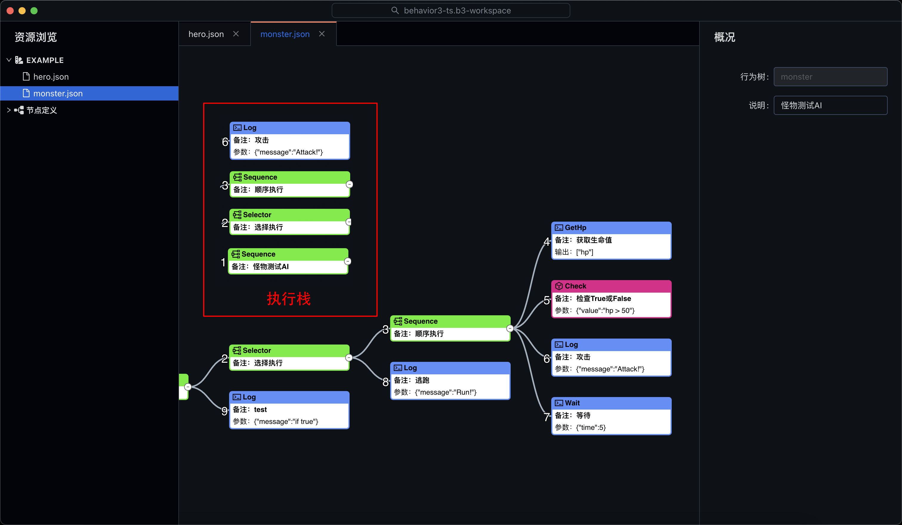
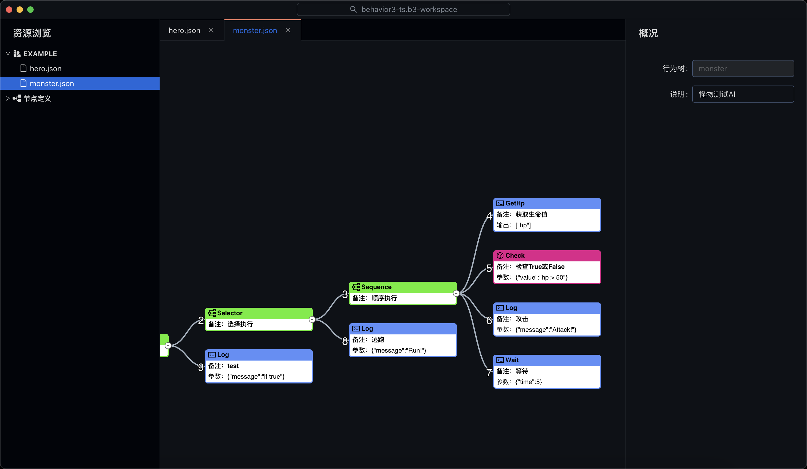

# 行为树框架 for typescript/javascript

## 基本概念

#### 节点数据结构

```javascript
{
    name: 'FindEnemy',        // 节点名称
    desc: '查找敌人'，          // 说明
    args: {w: 100, h: 50},    // 常量配置
    input: {'var1', 'var2'},  // 输入变量
    output: {'target'},       // 输出变量
    children: {}              // 子节点
}
```

#### 常量

通常是固定值，比如范围，类型之类的

#### 输入/输出变量

因为节点之间都有相互的影响，比如这个节点可能会用到上一个节点所产生的数据，所以大多数行为树设计者都提供一个数据结构来记录行为树的运行状态，称之为“黑板”。

我偷换了个概念，把节点当成一个 function 来执行，如上面一个节点定义的 input={'var1', 'var2'}意思是在执行节点前从黑板里把 var1 和 var2 这两个变量取出来，作为参数传进去，在节点执行完后把结果返回，写到 target 这个变量上。整个过程就像下面这段伪代码：

```typescript
override run(node: Node, env: RoleTreeEnv) {
        const args = node.args as FindEnemyArgs;
        const x = env.owner.x;
        const y = env.owner.y;
        const w = args.w;
        const h = args.h;
        const list = env.context.find((role: Role) => {
            if (role === env.owner) {
                return false;
            }
            const tx = role.x;
            const ty = role.y;
            return Math.abs(x - tx) <= w && Math.abs(y - ty) <= h;
        }, args.count ?? -1);
        if (list.length) {
            env.output.push(...list);
            return "success";
        } else {
            return "failure";
        }
    }
```

上面这个节点执行完，黑板上 target 这个变量就写上了查找到的目标，而后面的节点就可以使用 target 这个变量作为 input 了。

```javascript
{
    name: 'attack',
    desc: '攻击敌人',
    args: {skill: 101},
    input: {'target'},
}
```

#### 状态返回

-   SUCCESS 成功
-   FAILURE 失败
-   RUNNING 正在运行

## 复合节点

-   Parallel 并行执行, 执行所有子节点并反回 true
-   Sequence 顺序执行，执行所有子节点直到返回 false
-   Selector 选择执行，执行所有子节点直到返回 true

## 装饰节点

-   Not 取反
-   AlwaysSuccess
-   AlwaysFail

## 行为节点

-   Wait 等待一段时间后继续执行
-   MoveToTarget 移动到目标
-   GetHp 获取生命值
-   Attack 攻击目标

## Running 状态

做行为树始终绕不开一个问题，就是 `running` 状态，如果一套行为树方案没有 `running` 状态，那它只能用来做决策树，而不能做持续动作。要想实现 `running` 状态，关键是如何用上一次运行的节点恢复起来。行为树的节点调用很像程序的调用栈，其实对复合节点稍做改造即可实现：

-   只要是有任意子节点返回的是 `running`, 立即返回 `running`。
-   运行节点前把节点压入栈，如果该节点返回 `running`，则中断执行，等待下次 tick 唤醒，如果返回的是 `success` 或 `failure`，则出栈，继续往下执行。
    

## 编辑器

基于 antv G6 图形库开发了一个通用的行为树编辑器，感兴趣的同学可以关注一下 [behavior3editor](https://github.com/zhandouxiaojiji/behavior3editor)


## 运行测试用例

-   导出节点定义

```
// fs.writeFileSync("example/node-config.b3-setting", context.exportNodeDefs());
tsx test/main.ts
```

-   运行测试

```
npx tsx test/main.ts
```
